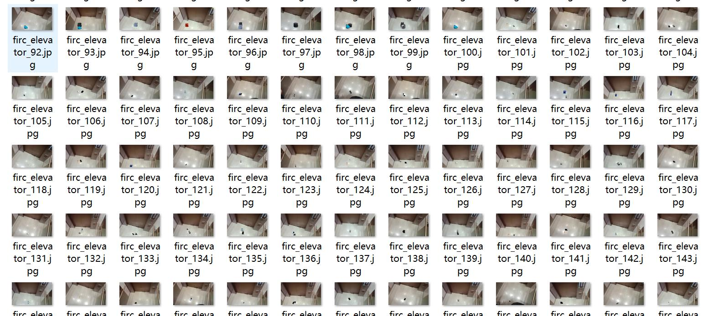
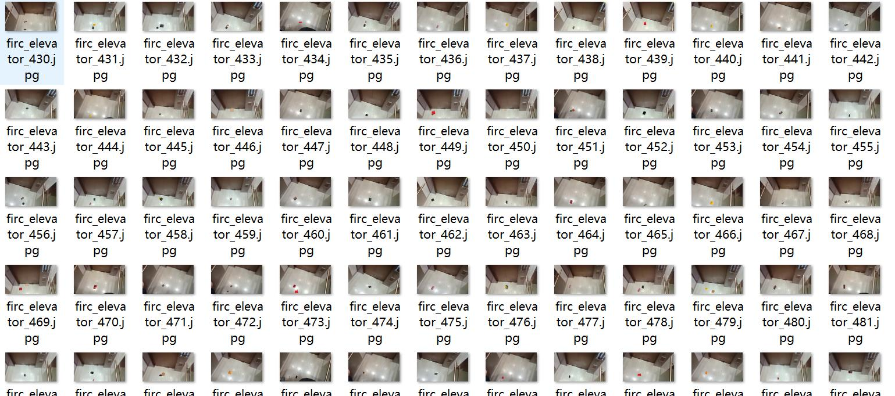
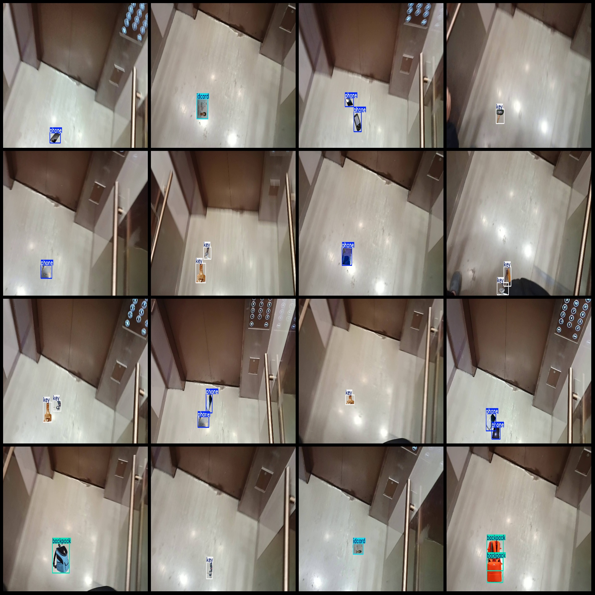
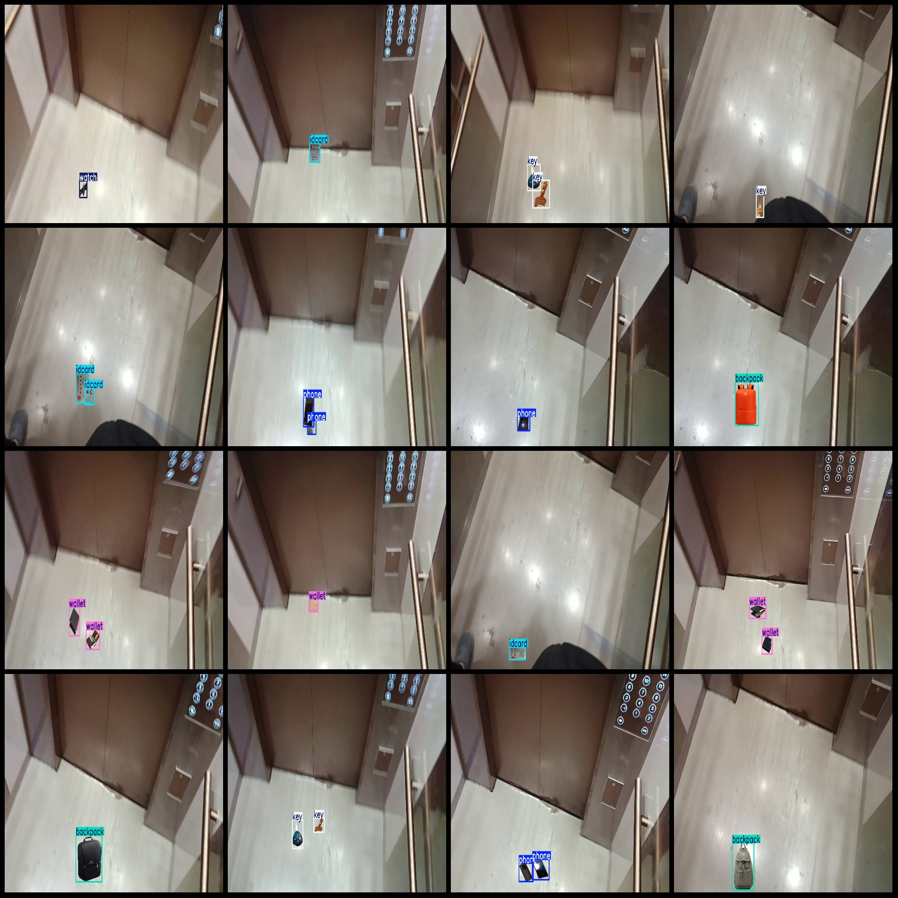

# Elevator Leftovers Detection Dataset: Pascal VOC+YOLO Format, 610 Images in 6 Categories

Dataset format: Pascal VOC format plus YOLO format (txt file without split path, only including jpg images and corresponding VOC format xml files and YOLO format txt files)
Number of images (jpg file count): 610
Number of annotations (xml file count): 610
Number of annotations (txt file count): 610
Number of categories: 6
Annotation category names: ["backpack", "idcard", "key", "phone", "wallet", "watch"]
Box counts per category:
- backpack (backpack) box count = 143
- idcard (ID card) box count = 149
- key (key) box count = 151
- phone (Phone) box count = 167
- wallet (Wallet) box count = 144
- watch (Watch) box count = 152
Total box count: 906
Image resolution: 1920x1080
Annotation tool used: labelImg
Annotation rules: draw boxes for each category
Important note: No specific instructions provided
Special declaration: This dataset does not guarantee the accuracy of the trained model or weight files
Image preview:

## Image

Here is a pay link on Stripe ( https://buy.stripe.com/3cs8yP7sY87d0vu9AB ). Please contact me lonlonago@foxmail.com after funding $89, and I will send you a complete data files , thank you!

